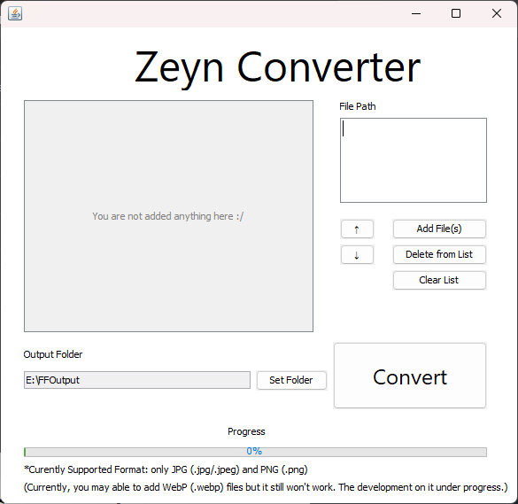

# ZeynConverter
> [!NOTE]
> Current Version: 0.1.1 (unstable)

Java based application that serves batch image conversion to PDF.


## Features
- Batch conversion for multiple images to a single PDF file.
- Flexible PDF page (following original image dimension).
- Drag and drop suppport.

## How to Use
1. Go to the [release page](https://github.com/ZeynTheDev/ZeynConverter/releases) of this repository.
2. Find the latest release (e.g., `v0.1.1`).
3. Based on your operating system, follow the steps below:

### 🖥️ For Windows Users
* Download the `.exe` file (e.g., `Zeyn Converter-0.1.1.exe`).
* Run the installer. It will automatically create desktop and Start Menu shortcuts.

### 🐧 For Linux Users
* Download the `.jar` file (e.g., `ZeynConverter-0.1.1.jar`).
* Make sure you have **Java Runtime Environment (JRE)** installed. You can get it from [Adoptium (OpenJDK)](https://adoptium.net/) or [Oracle](https://www.oracle.com/java/technologies/downloads/).
* Open your terminal, navigate to the download folder, and run:
    ```bash
    java -jar ZeynConverter-<version>.jar
    # change the <version> as the version number you downloaded (e.g. 0.1.1)
    ```
* Java environment configuration documentation can be read here: [Eclipse Temurin Documentation](https://adoptium.net/installation/linux/)

### 🍎 For macOS 
> The native installer (`.dmg`) is not available yet. This is planned for a future release.
* Follow the **exact same instructions** as the "For Linux Users" section.
* You only need the `.jar` file and a Java Runtime Environment (JRE).

## Development Plan
- Configuring WebP (`.webp`) support.
- Adding a custom icon.
- Adding sorting feature.
- Adding fixed size feature to help user that need a structured PDF page size.
- Adding app theme configuration (light/dark mode).
- Etc.

## Developer Talk on Current Version:
> Ru, ru-ru-ru-ru-ru-ru ♪  
> ♬ Ru-ru-ru-ru-ru-ru-ru-ru-ru, ah  
> ♬♪  
> ♬ Kimi no naka ni aru aka to aoki sen ♪

...

Oh, wait...  
I'm here wasn't for singing, but to talk about the current version! Hehe~

Okay, so, every detail about the current update (what's new, what's got fixed, bla bla bla) can be seen on the release page so just go here. I have no interest to discuss them here. Yeah, actually it's not a patch nor a big update, but just a minor fix but as I said: I have no interest to discuss them here so let's aside this topic.

Umm... What's again.... Oh, I remember! So, the development will be held for a while. My test will be held in late November so I need to start studying from now. Also, before that, I need to show my project result to my AI lecturer. No-no, it's not literally AI like terminator, but a lecturer on AI subject (I guess how wild people imagination that think that way :/) so yeah, I need to show that my model can classify the dataset properly. Let's hope I got A, or at least, B on this subject. Also, I have some planned activities on November and December IRL so yeah, let's just watch it.

So, as explained, that's the reason why the development would be held.

> "If that so, why do you release this minor update?"

Good question. Err.. actually, I got bored to always waiting the model training. Yes, it's fun, but it start boring when you overdo it. So that, I release it. Yeah, whatever.

Ok, maybe just it for this release. The next release would come in patch (`v0.2.0`). I think it would consuming a long time since the library for WebP was installed on my project, but it won't work when I start clean and build it. I'll try to find the way to configure it. ~~Let's hope I'm not got lazy for releasing the next patch.~~

Bye :)