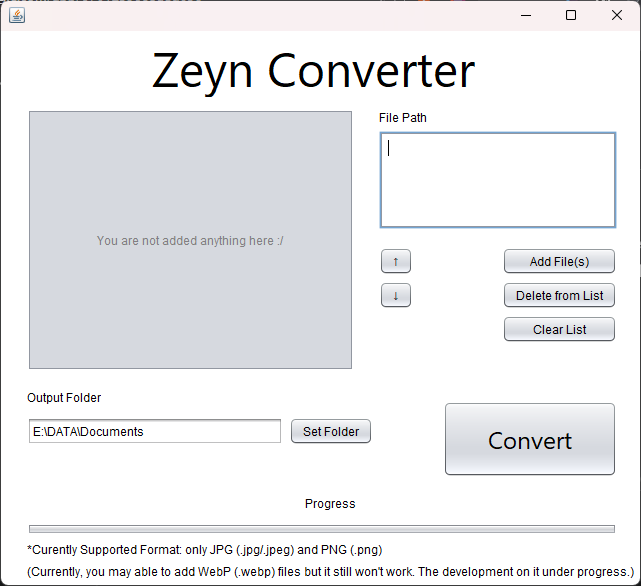

# ZeynConverter
> current version: 0.1.0 (unstable)

Java based application that serves batch image conversion to PDF.


## Features
- Batch conversion for multiple images to a single PDF file.
- Flexible PDF page (following original image dimension).
- Drag and drop suppport.

## How to Use
1. Go to the [release page](https://github.com/ZeynTheDev/ZeynConverter/releases) of this repository.
2. Find the latest release (e.g., `v0.1.0`).
3. Based on your operating system, follow the steps below:

### 🖥️ For Windows Users
* Download the `.exe` file (e.g., `Zeyn Converter-0.1.0.exe`).
* Run the installer. It will automatically create desktop and Start Menu shortcuts.

### 🐧 For Linux Users
* Download the `.jar` file (e.g., `ZeynConverter-0.1.0.jar`).
* Make sure you have **Java Runtime Environment (JRE)** installed. You can get it from [Adoptium (OpenJDK)](https://adoptium.net/) or [Oracle](https://www.oracle.com/java/technologies/downloads/).
* Open your terminal, navigate to the download folder, and run:
    ```bash
    java -jar ZeynConverter-<version>.jar
    # change the <version> as the version number you downloaded (e.g. 0.1.5)
    ```

### 🍎 For macOS 
> The native installer (`.dmg`) is not available yet. This is planned for a future release.
* Follow the **exact same instructions** as the "For Linux Users" section.
* You only need the `.jar` file and a Java Runtime Environment (JRE).

## Development Plan
- Configuring WebP (`.webp`) support.
- Adding a custom icon.
- Saving default path that customized by user.
- Adding sorting feature.
- Fixing path preview section.
- Adding fixed size feature to help user that need a structured PDF page size.
- Etc.

## Developer Talk on Current Version:
Hello, Zeyn The Dev here. Yeah, I never expected that this project could be born just because of my boredom on the weekend days lol :v Since I consulted AI actively on this project, so maybe there's many minor bugs, or many misspoints that should be configured for better performance and experience. I'll be so helpful for your feedbacks so let's we enjoy this application development together. But hey, people said, "If it worked, don't touch it" so can we guess this one as a step to success? :v