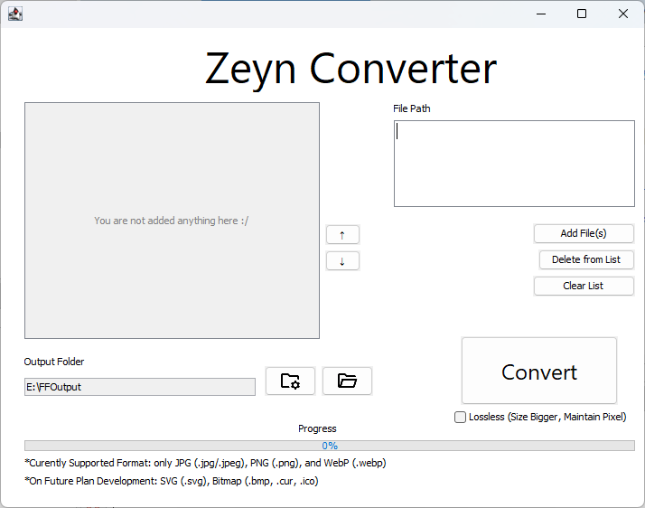

# ZeynConverter
> [!NOTE]
> Current Version: 0.2.0 (unstable)

Java based application that serves batch image conversion to PDF.


## Features
- Batch conversion for multiple images to a single PDF file.
- Flexible PDF page (following original image dimension).
- Multi format support (currently JPG, PNG, and WebP).
- Drag and drop suppport.

## How to Use
1. Go to the [release page](https://github.com/ZeynTheDev/ZeynConverter/releases) of this repository.
2. Find the latest release (e.g., `v0.2.0`).
3. Based on your operating system, follow the steps below:

### 🖥️ For Windows Users
* Download the `.exe` file (e.g., `Zeyn Converter-0.2.0.exe`).
* Run the installer. It will automatically create desktop and Start Menu shortcuts.

### 🐧 For Linux Users
* Download the `.jar` file (e.g., `ZeynConverter-0.2.0.jar`).
* Make sure you have **Java Runtime Environment (JRE)** installed. You can get it from [Adoptium (OpenJDK)](https://adoptium.net/) or [Oracle](https://www.oracle.com/java/technologies/downloads/).
* Open your terminal, navigate to the download folder, and run:
    ```bash
    java -jar ZeynConverter-<version>.jar
    # change the <version> as the version number you downloaded (e.g. 0.1.1)
    ```
* Java environment configuration documentation can be read here: [Eclipse Temurin Documentation](https://adoptium.net/installation/linux/)

### 🍎 For macOS 
> The native installer (`.dmg`) is not available yet. This is planned for a future release.
* Follow the **exact same instructions** as the "For Linux Users" section.
* You only need the `.jar` file and a Java Runtime Environment (JRE).

## Development Plan
### v0.3.0: PDF Layout Update
- Adding fixed size feature.
- Adding margin on fixed size feature.
### v0.4.0: Security & Options Update
- Adding feature to adjust document protection.
- Adding metadata configuration feature.
### v0.5.0: QOL and UI Update
- Adding sorting feature.
- Adding a custom icon.
### v0.6.0: Adding Format Support
- Adding Bitmap (`.bmp`, `.ico`, `.cur`) support.
- Adding Scalable Vector Graphic/SVG (`.svg`) support [I think it may be moved to v0.7.0 or any higher if I found it harder than expected]
### v0.7.0-0.x.x: ???
- Adding app theme configuration. [Target: v1.0.0]
- Etc.

## Developer Talk on Current Version
As promised, I'm back baby. Oh hell yeah. Finally I can fix the bug of WebP reading. Who guess that just changing this simple code:
```
PDImageXObject pdImage = PDImageXObject.createFromFile(imageFile.getAbsolutePath(), doc);
```
to this:
```
BufferedImage bImage = ImageIO.read(imageFile);
if (bImage == null) {
    throw new IOException("Failed to read image (plugin error): " + imageFile.getName());
}
PDImageXObject pdImage = LosslessFactory.createFromImage(doc, bImage);
```
and bum! The problem that haunted me along 2 weeks ago felt like just some stupid shit. I need to spent hours to just understanding it and then fix it. But actually, the bug hunt process quite fun so I'll let it away. So, we now can add WebP file, woohooo 🎉🎉

Also, I learn from this that I shouldn't just vibe coding it, but also understand it and give it some human touch since AI can't fully debugging it. I'll try to be a better developer later. Hehe~

Oh, and now, I've been infected by my friend, got "brainwashed" by his propaganda to play Osu! and yeah, suddenly it got 13 hours playtime. Time flies so fast, dude.

I'll try to ~~mastering osu and topping the leaderboard~~ still learn and becoming a good developer. I'll develop this application as long as I possible hehe~.

> "Where'd your promised `.dmg` installation file for Mac user, ha?!"

Erm... I suddenly remembered that I had something to do IRL. Bye :)